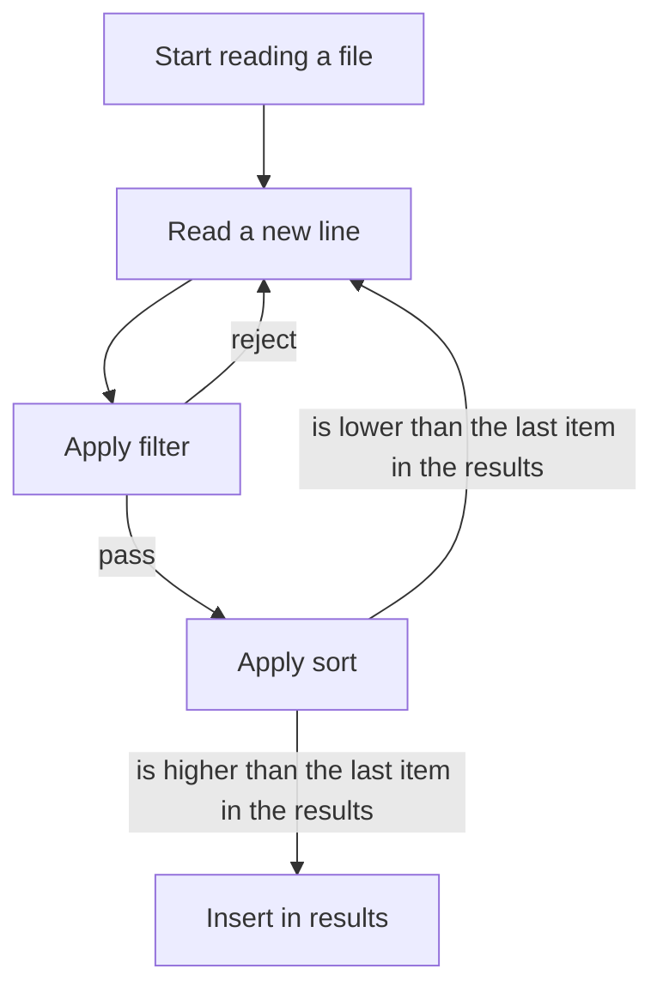

# Contributing

## How it currently works

The program keeps an array of top results at any given time. The size of the array is based on the `limit` setting in the configuration. The script goes through all files, reading through every line and `filter`ing and `sort`ing them based on the given configuration and then showing the final results.

